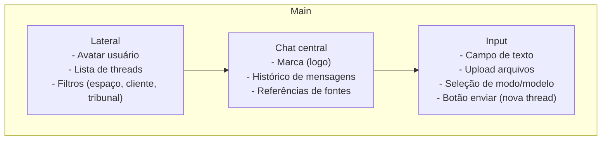

# Wireframes - Telas Principais (exemplo)

Notas rápidas:
- O `ChatPane` exibe referência de fonte abaixo de cada mensagem (ex.: DataJud, STJ, legislação).
- O `Bottom` permite upload múltiplo, seleção de `modo` (consulta / rascunho / resumo) e quick-settings (idioma, formalidade).
- Ao clicar no `avatar`, abre painel de perfil e configurações (OAB, integrações, keys).
